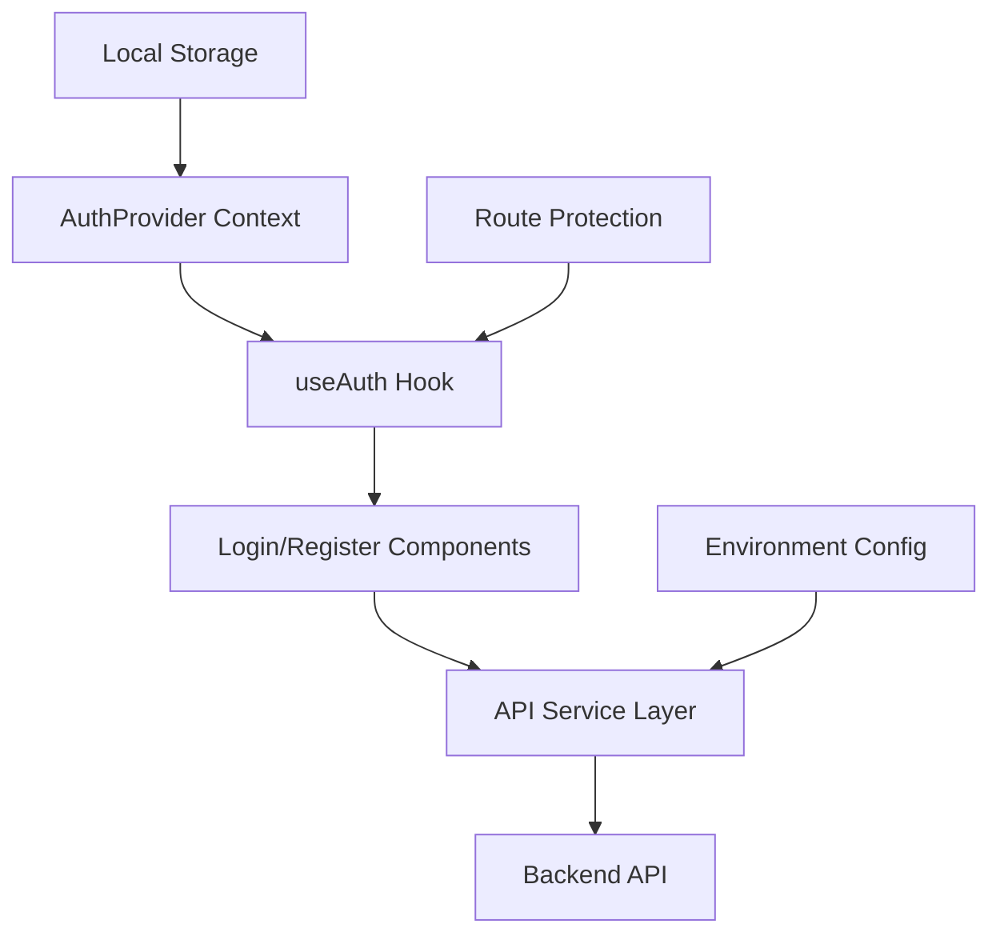

# Authentication System Design

## Overview

This design transforms the existing SignupComponent into a comprehensive authentication system that provides both login and registration functionality with improved UX, proper API integration, and persistent authentication state management. The system will use React hooks for state management, axios for HTTP requests, and environment variables for configuration.

## Architecture

### High-Level Architecture



### Component Structure

```
app/
├── components/
│   ├── auth/
│   │   ├── AuthProvider.tsx          # Context provider for auth state
│   │   ├── LoginForm.tsx             # Login form component
│   │   ├── RegisterForm.tsx          # Registration form component
│   │   ├── AuthLayout.tsx            # Shared layout for auth pages
│   │   └── ProtectedRoute.tsx        # Route protection wrapper
│   └── ui/
│       ├── FormField.tsx             # Reusable form input component
│       ├── LoadingButton.tsx         # Button with loading state
│       └── ErrorMessage.tsx          # Error display component
├── hooks/
│   └── useAuth.ts                    # Authentication hook
├── services/
│   ├── api.ts                        # Axios configuration
│   └── auth.ts                       # Authentication API calls
├── types/
│   └── auth.ts                       # TypeScript interfaces
└── utils/
    ├── validation.ts                 # Form validation utilities
    └── storage.ts                    # Local storage utilities
```

## Components and Interfaces

### 1. Authentication Context & Hook

**AuthProvider Context:**
- Manages global authentication state
- Provides authentication methods to child components
- Handles token persistence and validation
- Automatically checks authentication status on app load

**useAuth Hook:**
- Exposes authentication state and methods
- Provides login, register, logout functions
- Returns loading states and error handling
- Manages token refresh logic

### 2. Form Components

**AuthLayout Component:**
- Shared layout for login and registration pages
- Maintains the existing visual design with yoga image
- Responsive design for mobile and desktop
- Instantaneous switching between login/register forms without page reload
- Smooth animations for form transitions using Framer Motion
- Preserves form state during quick switches

**LoginForm Component:**
- Clean form with floating labels
- Real-time validation feedback
- Loading states during submission
- Error message display
- Link to switch to registration

**RegisterForm Component:**
- Enhanced version of current SignupComponent
- Improved form labels and validation
- Password strength indicator
- Terms acceptance checkbox
- Link to switch to login

**FormField Component:**
- Reusable input component with floating labels
- Built-in validation state display
- Consistent styling across forms
- Support for different input types

### 3. API Service Layer

**API Configuration:**
- Axios instance with base URL from environment
- Request/response interceptors for token handling
- Error handling and retry logic
- TypeScript interfaces for API responses

**Authentication Service:**
- Login and registration API calls
- Token management utilities
- User profile fetching
- Logout functionality

## Data Models

### User Interface
```typescript
interface User {
  id: string;
  username: string;
  email?: string;
  createdAt: string;
}
```

### Authentication State
```typescript
interface AuthState {
  user: User | null;
  token: string | null;
  isLoading: boolean;
  isAuthenticated: boolean;
}
```

### API Response Types
```typescript
interface LoginResponse {
  token: string;
  user: User;
}

interface RegisterResponse {
  token: string;
  user: User;
}

interface ApiError {
  message: string;
  errors?: Record<string, string[]>;
}
```

### Form Data Types
```typescript
interface LoginFormData {
  username: string;
  password: string;
}

interface RegisterFormData {
  username: string;
  password: string;
  confirmPassword: string;
}

interface AuthFormState {
  mode: 'login' | 'register';
  formData: LoginFormData | RegisterFormData;
  errors: Record<string, string>;
  isLoading: boolean;
}
```

## Error Handling

### Client-Side Validation
- Real-time form validation with immediate feedback
- Password strength validation with visual indicators
- Username format validation
- Required field validation with clear messaging

### API Error Handling
- Network error detection and user-friendly messages
- Server validation error mapping to form fields
- Token expiration handling with automatic logout
- Retry logic for transient failures

### Error Display Strategy
- Field-level errors displayed below inputs
- Form-level errors displayed at the top
- Toast notifications for system-level errors
- Loading states to prevent user confusion

## Testing Strategy

### Unit Testing
- Form validation logic testing
- Authentication hook state management
- API service method testing
- Utility function testing

### Integration Testing
- Complete authentication flow testing
- Form submission and error handling
- Token persistence and retrieval
- Route protection functionality

### User Experience Testing
- Form accessibility compliance
- Mobile responsiveness validation
- Loading state user experience
- Error message clarity and helpfulness

## Implementation Details

### Environment Configuration
```typescript
// Environment variables
NEXT_PUBLIC_API_BASE_URL=http://localhost:5152
```

### Token Management
- JWT tokens stored in localStorage
- Automatic token inclusion in API requests
- Token expiration handling
- Secure token removal on logout

### Form Enhancement Features
- Floating labels that move on focus/input
- Password visibility toggle
- Form submission loading states
- Keyboard navigation support
- Screen reader accessibility
- Instantaneous form mode switching with smooth animations
- Form data preservation during quick switches between login/register
- Single-page authentication experience without navigation

### State Management Flow
1. App initialization checks for existing token
2. Token validation against API if present
3. User state populated on successful validation
4. Protected routes redirect to login if unauthenticated
5. Successful login/register updates global state
6. Logout clears state and redirects to login
7. Form switching between login/register is instantaneous with local state management
8. Form data is temporarily preserved during quick switches to prevent user frustration

### API Integration Pattern
- Centralized axios configuration with interceptors
- Consistent error handling across all requests
- Request/response logging for development
- Automatic token refresh on 401 responses

### Responsive Design Considerations
- Mobile-first approach with touch-friendly inputs
- Optimized form layout for small screens
- Accessible form controls and navigation
- Consistent visual hierarchy across devices